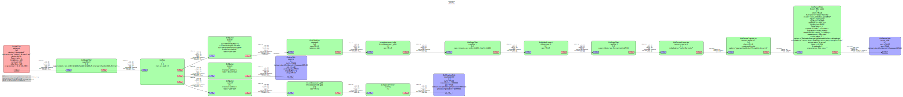
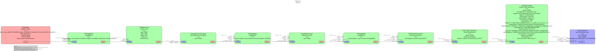

# i.MX Smart Fitness

[](./LICENSE)

i.MX Smart Fitness showcases the i.MX' Machine Learning capabilities by using an NPU to accelerate two Deep Learning
vision-based models. Together, these models detect a person present in the scene and predict 33 3D-keypoints to
generate a complete body landmark, known as pose estimation. From the pose estimation, a K-NN pose classifier
classifies two different body poses: 'Squat-Down' and 'Squat-Up'. The application tracks the 'squats' fitness exercise
and the repetition counter is set to 12 repetitions in an infinite loop.

This application is developed using GStreamer and NNStreamer. On the i.MX93, PXP acceleration is used for the color
space conversion and frame resizing during pre-processing and post-processing of data. On i.MX8M Plus, the GPU-2D
accelerator is used for the same purpose.


## Implementation using GStreamer and NNStreamer

Two GStreamer + NNStreamer pipelines are used in this application. The main pipeline captures the input video frames
from the camera, detects the human pose present in the scene and prints the pose detections and landmark keypoints on
the display. When a pose is detected, the main pipeline sends the input frame together with the bounding box
coordinates to the secondary pipeline through an appsink element. The secondary pipeline detects the pose landmark
keypoints whenever a pose is detected. When no pose is detected, the main pipeline does not send any frame to the
secondary pipeline and no inference is done for landmark detection. Secondary pipeline receives the input frames
through an appsrc element synchronized with the primary pipeline.

### Main Pipeline

* Captures video from camera
* Runs pose detection (pose_detection_quant.tflite) model
* Overlays detection on top of video before display
* Schedules secondary pipeline execution



### Secondary Pipeline

* Uses input from main pipeline: video frame and pose detection results
* Is scheduled once per pose detected
* Crops video for detected poses in video stream
* Runs second ML model inference (pose_landmark_lite_quant.tflite) on cropped video



## Downlowad, convert, quantize and export ML models

Follow the instructions included in [./models](./models/) to download, convert, quantize and export the
ML models. Once models are ready, find them inside the `./models/deploy` folder.

## How to build, compile and run application

1. Clone the repository in your host machine:

```bash
git clone https://github.com/nxp-imx-support/imx-smart-fitness
cd imx-smart-fitness
```

2. Create build directory and compile project using CMake:

```bash
mkdir build

# Use your BSP toolchain for cross-compilation (it may change depending on your specific installation)
source /opt/fsl-imx-xwayland/6.1-mickledore/environment-setup-armv8a-poky-linux

# Build and compile project
cmake -D CMAKE_BUILD_TYPE=Release -D CMAKE_EXPORT_COMPILE_COMMANDS=ON -S ./ -B build/
cmake --build build/ 

# If desired, strip the binary (recommended)
$STRIP --remove-section=.comment --remove-section=.note --strip-unneeded build/src/imx-smart-fitness
```

3. Copy binary and models to the target board:

```bash
scp build/src/imx-smart-fitness models/deploy/* root@<ip-address>:
```

5. On i.MX93, compile the models with Vela compiler tool:

```bash
vela pose_detection_quant.tflite && mv output/pose_detection_quant_vela.tflite .
vela pose_landmark_lite_quant.tflite && mv output/pose_landmark_lite_quant_vela.tflite .
```

6. Connect a USB camera to the board along with a monitor or display. Run the
following command depending on the target:

```bash
# On i.MX93:
./imx-smart-fitness --device=/dev/video0 \
                    --target=i.MX93 \
                    --pose-detection-model=./pose_detection_quant_vela.tflite \
                    --pose-landmark-model=./pose_landmark_lite_quant_vela.tflite \
                    --pose-embeddings=pose_embeddings.csv \
                    --anchors=anchors.txt

# On i.MX8M Plus:
./imx-smart-fitness --device=/dev/video3 \
                    --target=i.MX8MP \
                    --pose-detection-model=./pose_detection_quant.tflite \
                    --pose-landmark-model=./pose_landmark_lite_quant.tflite \
                    --pose-embeddings=pose_embeddings.csv \
                    --anchors=anchors.txt
```

**NOTE:** On i.MX8M Plus, it is recommended to run these commands before first excecution:

```bash
export VIV_VX_ENABLE_CACHE_GRAPH_BINARY="1"
export VIV_VX_CACHE_BINARY_GRAPH_DIR=`pwd`

/usr/bin/tensorflow-lite-2.11.1/examples/benchmark_model --graph=pose_detection_quant.tflite --external_delegate_path=/usr/lib/libvx_delegate.so
/usr/bin/tensorflow-lite-2.11.1/examples/benchmark_model --graph=pose_landmark_lite_quant.tflite --external_delegate_path=/usr/lib/libvx_delegate.so
```

**NOTE 2:** Supported on i.MX93 BSP >= LF6.1.55_2.2.0. Previous BSPs do not support Ethos-U Delegate with multiple models on NNStreamer.

## Licensing

Please see the LICENSE.txt file for more information.
