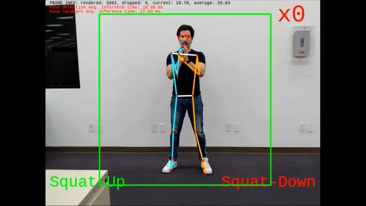
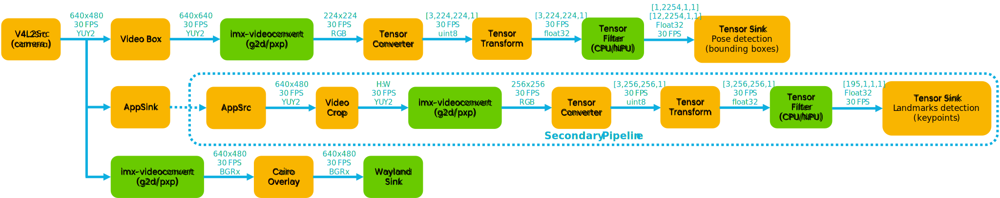

# i.MX Smart Fitness

<!----- Boards ----->
[](./Apache-2.0.txt)
[](https://www.nxp.com/products/processors-and-microcontrollers/arm-processors/i-mx-applications-processors/i-mx-8-applications-processors/i-mx-8m-plus-arm-cortex-a53-machine-learning-vision-multimedia-and-industrial-iot:IMX8MPLUS)
[](https://www.nxp.com/products/processors-and-microcontrollers/arm-processors/i-mx-applications-processors/i-mx-9-processors/i-mx-93-applications-processor-family-arm-cortex-a55-ml-acceleration-power-efficient-mpu:i.MX93)

[](https://www.nxp.com/docs/en/user-guide/IMX-MACHINE-LEARNING-UG.pdf) 


[*i.MX Smart Fitness*](https://github.com/nxp-imx-support/imx-smart-fitness) showcases the *Machine Learning* (ML)
capabilities of i.MX SoCs by using a *Neural Processing Unit* (NPU) to accelerate two Deep Learning vision-based models.
Together, these models detect a person present in the scene and predict 33 3D-keypoints to generate a complete body landmark,
known as pose estimation. From the pose estimation, a K-NN pose classifier classifies two different body poses:
'*Squat-Down*' and '*Squat-Up*'. The application tracks the 'squats' fitness exercise and the repetition counter is set
to 12 repetitions in an infinite loop.

This application is developed using GStreamer and NNStreamer. On the i.MX 93, *PXP* acceleration is used for the color
space conversion and frame resizing during pre-processing and post-processing of data. On i.MX 8M Plus, the *2D-GPU*
accelerator is used for the same purpose.



## Implementation using GStreamer and NNStreamer

>**NOTE:** This block diagram is simplified and do not represent the complete GStreamer + NNStreamer pipeline elements. Some elements
were omitted and only the key elements are shown.

Two GStreamer + NNStreamer pipelines are used in this application. The main pipeline captures the input video frames
from the camera, detects the human pose present in the scene and prints the pose detections and landmark keypoints on
the display. When a pose is detected, the main pipeline sends the input frame together with the bounding box
coordinates to the secondary pipeline through an `appsink` element. The secondary pipeline detects the pose landmark
keypoints whenever a pose is detected. When no pose is detected, the main pipeline does not send any frame to the
secondary pipeline and no inference is done for landmark detection. Secondary pipeline receives the input frames
through an `appsrc` element synchronized with the primary pipeline. Below is a simplified block diagram of the
pipeline.



### Main Pipeline

* Captures video from camera
* Runs pose detection model
* Overlays detection on top of video before display
* Schedules secondary pipeline execution

### Secondary Pipeline

* Uses input from main pipeline: video frame and pose detection results
* Is scheduled once per pose detected
* Crops video for detected poses in video stream
* Runs second ML model inference on cropped video

## Software

*i.MX Smart Fitness* is part of Linux BSP available at [Embedded Linux for i.MX Applications Processors](https://www.nxp.com/design/design-center/software/embedded-software/i-mx-software/embedded-linux-for-i-mx-applications-processors:IMXLINUX). All the required software and dependencies to run this
application are already included in the BSP.

i.MX Board          | Main Software Components
---                 | ---
**i.MX8M Plus EVK** | GStreamer + NNStreamer<br>VX Delegate (NPU)     
**i.MX93 EVK**      | GStreamer + NNStreamer<br>Ethos-U Delegate (NPU)

## Hardware

To test *i.MX Smart Fitness*, either the i.MX 8M Plus or i.MX 93 EVKs are required with their respective hardware components.

Component                                         | i.MX 8M Plus        | i.MX 93
---                                               | :---:              | :---:
Power Supply                                      | :white_check_mark: | :white_check_mark:
HDMI Display                                      | :white_check_mark: | :white_check_mark:
USB micro-B cable (Type-A male to Micro-B male)   | :white_check_mark: |                   
USB Type-C cable  (Type-A male to Type-C male)    |                    | :white_check_mark:
HDMI cable                                        | :white_check_mark: | :white_check_mark:
IMX-MIPI-HDMI (MIPI-DSI to HDMI adapter)          |                    | :white_check_mark:
Mini-SAS cable                                    |                    | :white_check_mark:
MIPI-CSI camera module                            | :white_check_mark: | :white_check_mark:
USB camera (optional, if no MIPI-CSI camera used) | :white_check_mark: | :white_check_mark:
Mouse                                             | :white_check_mark: | :white_check_mark:

## Run i.MX Smart Fitness on GoPoint

This example application has been integrated into the "*GoPoint for i.MX Applications Processors*" package.
You can run *i.MX Smart Fitness* by following the steps found at: [nxp-demo-experience-demos-list](https://github.com/nxp-imx-support/nxp-demo-experience-demos-list).

The steps are located in the README.md file inside `scripts/machine_learning/imx_smart_fitness/README.md`. These
steps are for those who do not want to spend the time in building and compiling the standalone project.

## Downlowad, convert, quantize and export ML models

Follow the instructions included in [./models](./models/) to download, convert, quantize and export the
ML models. Once models are ready, find them inside the `./models/deploy` folder.

## How to build, compile and run application

>**NOTE:** Make sure you have the quantized models by following the steps from above.

1. Clone the repository in your host machine:

```bash
git clone https://github.com/nxp-imx-support/imx-smart-fitness
cd imx-smart-fitness
```

2. Create build directory and compile project using CMake:

```bash
mkdir build

# Use your BSP toolchain for cross-compilation (it may change depending on your specific installation)
source /opt/fsl-imx-xwayland/6.1-mickledore/environment-setup-armv8a-poky-linux

# Build and compile project
cmake -D CMAKE_BUILD_TYPE=Release -D CMAKE_EXPORT_COMPILE_COMMANDS=ON -S ./ -B build/
cmake --build build/ 

# If desired, strip the binary (recommended)
$STRIP --remove-section=.comment --remove-section=.note --strip-unneeded build/src/imx-smart-fitness
```

3. Copy binary and models to the target board:

```bash
scp build/src/imx-smart-fitness models/deploy/* root@<ip-address>:
```

5. On i.MX 93, compile the models with Vela compiler tool:

```bash
vela pose_detection_quant.tflite && mv output/pose_detection_quant_vela.tflite .
vela pose_landmark_lite_quant.tflite && mv output/pose_landmark_lite_quant_vela.tflite .
```

6. Connect a USB camera to the board along with a monitor or display. Run the
following command depending on the target:

```bash
# On i.MX 93:
./imx-smart-fitness --device=/dev/video0 \
                    --target=i.MX93 \
                    --pose-detection-model=./pose_detection_quant_vela.tflite \
                    --pose-landmark-model=./pose_landmark_lite_quant_vela.tflite \
                    --pose-embeddings=pose_embeddings.csv \
                    --anchors=anchors.txt

# On i.MX 8M Plus:
./imx-smart-fitness --device=/dev/video3 \
                    --target=i.MX8MP \
                    --pose-detection-model=./pose_detection_quant.tflite \
                    --pose-landmark-model=./pose_landmark_lite_quant.tflite \
                    --pose-embeddings=pose_embeddings.csv \
                    --anchors=anchors.txt
```

**NOTE:** On i.MX 8M Plus, it is recommended to run these commands before first excecution:

```bash
export VIV_VX_ENABLE_CACHE_GRAPH_BINARY="1"
export VIV_VX_CACHE_BINARY_GRAPH_DIR=`pwd`

/usr/bin/tensorflow-lite-2.*.*/examples/benchmark_model --graph=pose_detection_quant.tflite --external_delegate_path=/usr/lib/libvx_delegate.so
/usr/bin/tensorflow-lite-2.*.*/examples/benchmark_model --graph=pose_landmark_lite_quant.tflite --external_delegate_path=/usr/lib/libvx_delegate.so
```

**NOTE 2:** Supported on i.MX 93 BSP >= LF6.1.55_2.2.0. Previous BSPs do not support Ethos-U Delegate with multiple models on NNStreamer.

## Using Basler or OS08A20 cameras

If you want to use these cameras, you need to change the device tree:

- Open the Arm Cortex-A core console as descibed in the Section 3:
**Basic Terminal Setup** of the [i.MX Linux User's Guide](https://www.nxp.com/docs/en/user-guide/IMX_LINUX_USERS_GUIDE.pdf)
, then press any key to enter U-Boot console.

- There, enter the following command: `fatls mmc ${mmcdev}:${mmcpart}`.
You should see a list of all available device tree files. Make sure
the device trees **imx8mp-evk-basler.dtb** and **imx8mp-evk-os08a20.dtb**
are listed.

- Change the device tree using the `editenv fdtfile` command. Replace the
.dtb file with **imx8mp-evk-basler.dtb** or **imx8mp-evk-os08a20.dtb**
, depending on which camera you are using, and enter the `boot` command.

- *Optional*. You can save this configuration using the `saveenv` command to
the next time you use the board.

## Licensing

*i.MX Smart Fitness* is licensed under the [Apache-2.0 License](https://www.apache.org/licenses/LICENSE-2.0).
